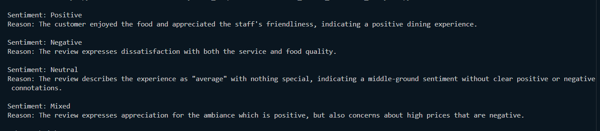

# 🍽️ Restaurant Review Sentiment Analysis

A Python-based GenAI application that performs sentiment analysis on restaurant reviews using the **Phi-3 Large Language Model** running locally with **Ollama**.

## Features

- Analyze restaurant reviews
- Classify sentiment as **Positive**, **Negative**, **Neutral**, or **Mixed**
- Generate a brief explanation for each prediction
- Runs completely offline using a local LLM

## Tech Stack

- Python 3.11
- Ollama
- Phi-3
- VS Code

## Installation

1. Install Ollama
2. Pull the Phi-3 model

```bash
ollama pull phi3
```

3. Install the Python package

```bash
pip install ollama
```

## Run

```bash
python resturant_review_sentiment_analysis.py
```

## Sample Output

```text
Sentiment: Mixed
Reason: The review praises the food but highlights slow service.
```

## Learning Outcomes

- Local LLM integration with Python
- Prompt engineering
- AI-powered sentiment analysis
- Building GenAI applications without paid APIs

## Sample Output

